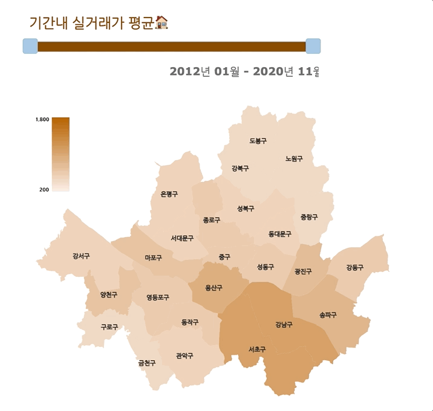
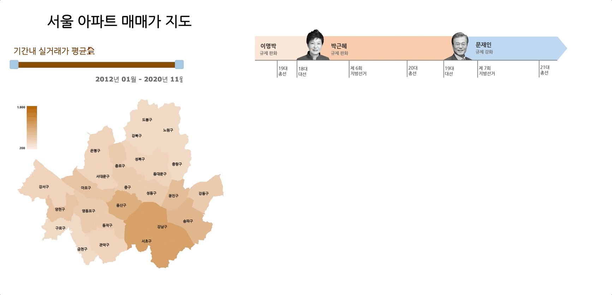
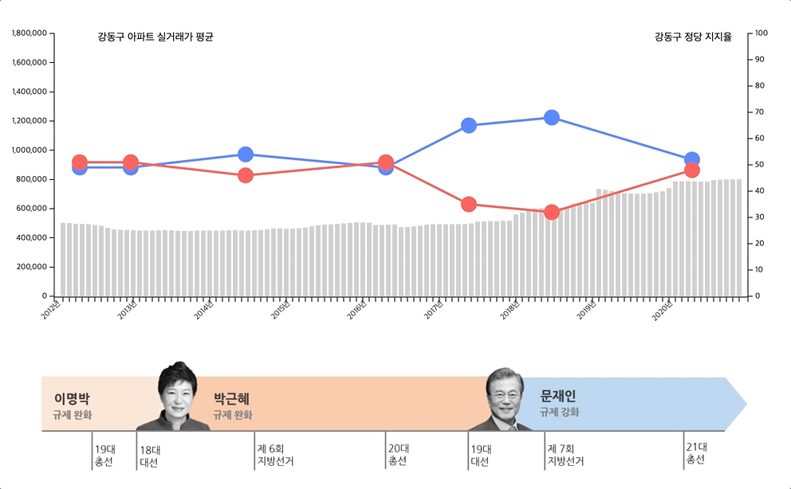

# InformationDesign

2020년 아주대학교 정보디자인 프로젝트입니다.

https://informationdesign.pages.dev/

 

2012년 1월부터 2020년 11월까지의 실거래가를 상단의 바의 조절을 통해 그래픽 이미지로 확인할 수 있습니다.

 

세부정보의 확인을 희망하는 지역을 클릭함으로 해당 지역의 정당 지지율과 실거래가의 그래프를 확인할 수 있습니다.

 
 

그래프에 마우스를 호버링하여 구체적인 수치를 확인할 수 있습니다.
